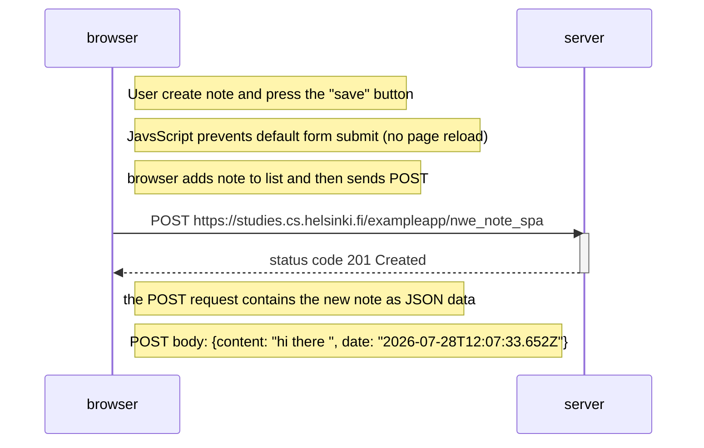

```mermaid
sequenceDiagram
    participant browser
    participant server

    Note right of browser: User create note and press the "save" button
    Note right of browser: JavsScript prevents default form submit (no page reload)
    Note right of browser: browser adds note to list and then sends POST

    browser->>server: POST https://studies.cs.helsinki.fi/exampleapp/nwe_note_spa
    activate server
    server-->>browser: status code 201 Created
    deactivate server

    Note right of browser: the POST request contains the new note as JSON data
    Note right of browser: POST body: {content: "hi there ", date: "2026-07-28T12:07:33.652Z"}
```